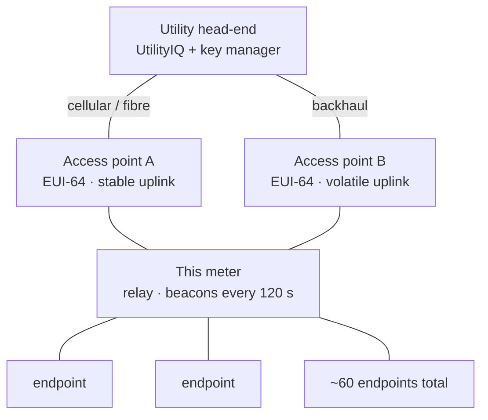

# Silver Spring / Aclara AMI mesh — transport-layer protocol

Reverse-engineered passively from a residential electric meter (Aclara I-210+c,
Silver Spring NIC 511) on the 902–928 MHz ISM band, using an RTL-SDR. This
documents the recovered **transport layer**. The application payload is AES-CCM*
encrypted and is not covered — only shown to be encrypted.

All node identifiers below are illustrative; real captured identifiers are not
published.

## Protocol variant

rtl_433 ships a Silver Spring decoder (`silver_spring_mesh.c`) for a
drive-by/water-meter variant with an 8-bit scrambler, a 3-byte PHR and an
`SFD 0xF3A0`. The frames analysed here — from a fixed-AMI Aclara I-210+c —
do **not** match that framing or scrambler, and the difference is verified:

* The 8-bit scrambler descrambles none of these frames under any of its 255
  seeds; the degree-9 LFSR below recovers the correct `00:13:50` OUI on all of
  them.
* Berlekamp–Massey measures this keystream's linear complexity as 9. An 8-bit
  LFSR has complexity ≤ 8 and mathematically cannot generate it.

Both analyses are correct for their own captures. What follows is the fixed-AMI
variant.

## Physical layer

2-GFSK, modulation index ≈ 0.5, at 100/150/200 kBd (per-frame). Bursts extracted
from raw IQ by envelope energy detection (+8 dB over the median floor, 2 ms
margin, sub-bursts merged within 5 ms), then demodulated by frequency
discrimination and timing recovery.

## PHY header — the channel is in the clear

What looked like a 32-bit sync word is a 4-byte header: `0C 5F <X> FF`. Bytes 0,
1 and 3 are constant; **byte 2 is the channel number**, as `N = 255 − X`. Fitting
the per-frame carrier against N gives:

```
f(N) = 902.2990 MHz + 299.991 kHz · N        N = 0 … 86   (87 channels)
```

Residuals are 0–2 kHz on a 300 kHz grid for every channel the receiver could
hear. This **contradicts the published figure** of 64 channels at 400 kHz.

## Framing grammar

The length field determines the header stack deterministically. This grammar
parses every byte of all captured frames:

```
frame := SRC(8) [DST(8)] {headers} payload TRAILER(1)

ln= 12   SRC | 04 81 xx | TRAILER
ln= 14   SRC | 01 03 aa bb cc | TRAILER
ln= 22   SRC | DST | 01 03 aa bb cc | TRAILER
ln= 29   SRC | DST | 01 03 .. | PAYLOAD(7) | TRAILER
ln= 55   SRC | 01 03 .. | 04 81 xx | PAYLOAD(38) | TRAILER
ln=111   SRC | 01 80 | 00 82 .. | PAYLOAD(96) | TRAILER   (beacon)
ln=213   SRC | 00 82 .. | 01 03 .. | PAYLOAD(195) | TRAILER  (encrypted)
```

Node addresses are 8 bytes with OUI `00:13:50` (Silver Spring). Endpoints use a
serial format (`00:13:50:05:00:xx:xx:xx`); infrastructure/access points use an
EUI-64 form (`00:13:50:FF:FE:60:xx:xx:xx`, a MAC-48 → EUI-64 mapping).
`01 03 aa bb cc` is a link header whose `aa bb` are zero exactly when no
destination is present. `04 81 xx` carries a per-node routing cost.

## Data whitening — degree-9 LFSR (recovered by Berlekamp–Massey)

The PSDU is whitened. Long frames carry a run of all-zero payload padding, so the
ciphertext there is the raw keystream. Berlekamp–Massey on 192 bits of it returns
**linear complexity 9** (a random stream would give ~96), immediately recovering
the generator:

```
b[n] = b[n-1] ⊕ b[n-2] ⊕ b[n-5] ⊕ b[n-8] ⊕ b[n-9]        period 255
```

Because plaintext bytes 0–4 are the constant serial prefix `00 13 50 05 00`, the
mask for *any* frame is recoverable from that frame alone
(`mask[0:5] = cipher[0:5] ⊕ prefix` seeds the 9-bit register), so de-whitening
needs no phase bookkeeping. Validated on 100% of captured frames de-whitening to
a valid serial prefix — chance 2⁻⁴⁰ per frame.

## Integrity — CRC-32

The trailing byte is the top byte of a CRC-32 (poly `0x04C11DB7`, MSB-first,
init 0) over the de-whitened frame, XORed with a per-length constant K[len]. It
validates on 386/392 real frames; the 6 failures are independently corroborated
corrupt frames (nonzero data in known-zero pad regions, single-bit-flipped
addresses). An exhaustive CRC-8 / CRC-16 search had earlier (wrongly) concluded
no linear checksum existed — the answer was a truncated CRC-32, outside that
search space.

## Flags byte

`fl = base(channel) ⊕ code`, where code ∈ {0 = broadcast, 2 = unicast, 3 =
beacon}. The top six bits track the channel; the low two are a frame-type field.
Zero exceptions across 445 frames.

## Beacon timing and frequency hopping

One node type — the local relay — beacons on an **exact 120.000 s lattice**
(phase σ = 0.25 s over 450+ cycles). Assigning each beacon an integer slot index,
the channel is a function of **slot mod 83**: uniquely at N = 83, with 153/153
strictly causal forward predictions and a search-corrected permutation null of
0/3000. Cycle length 83 × 120 s ≈ 2 h 46 min. (The 87-channel plan vs 83-slot
period differ by four — possibly guard channels; unresolved.)

## Network topology

The addressing and the beacon's own routing records reveal the mesh structure —
and it is not flat. Two device classes are distinguished by address format:

| Class | Address format | Role |
|---|---|---|
| Endpoint | serial `00:13:50:05:00:xx:xx:xx` | leaf meters (~60 seen) |
| Infrastructure | EUI-64 `00:13:50:FF:FE:60:xx:xx:xx` | access points / collectors (2 primary) |

The meter studied sits mid-tree as a **relay**, and its 120 s beacon advertises
its route:



**The route is remarkably stable.** Across 227 beacons over 68 h, the relay
advertised the *same two access points* every time (221/227; a handful briefly
swapped a third). It is not wandering the mesh — it holds a fixed
primary + secondary uplink.

**The beacon reports live link health.** Two bytes in the beacon are the relay's
own link-quality estimate to each access point, and they behave completely
differently:

| Uplink | Metric byte | Mean | Std dev | Reading |
|---|---|---|---|---|
| Access point A | b51 | 189 | **8** | stable — primary |
| Access point B | b95 | 67 | **86** (range 0–255) | volatile — backup |

This resolved a long-running false lead: byte b95 looked like a drifting counter
for days. It is neither counter nor clock — it is the meter broadcasting its
real-time link quality to its secondary collector, swinging with propagation.
The tree below the relay is shallow: the ~60 endpoints carry a route-cost byte
peaking at 3–5 with a tail to 24 (most near, a few deep).

**The access points are never heard on air** (zero frames sourced by any EUI-64
node). They are the root of this cell's tree, on channels the receiver never
monitored; they are known only by name, from the relay's own beacon. There is no
way to make an access point respond to an outside receiver — it answers only
enrolled, authenticated nodes, which is the mesh security model working as
designed. Consumption uploads converge on these collectors, on their own
schedule, and are the traffic a single fixed receiver is least likely to catch.

*Note on observation geometry:* because the receiver sits on the relay's own
listening channel, it hears everything addressed **to** the relay and little else
— so the relay's apparent centrality is partly real (it is a well-connected
router) and partly an artifact of where the antenna sits. Both are stated rather
than conflated.

## The application payload is encrypted

The `ln=213` payload (195 bytes) is uniform-entropy with no zero bytes. Two such
frames from the same source, captured 22 h apart, **XOR to full-entropy noise**
(3/195 identical bytes) — proving per-frame keystream uniqueness. That excludes a
fixed scrambler or keystream reuse. Combined with a per-frame nonce field in the
clear and incompressibility (no gzip/zlib/bzip2/lzma/lz4 container at any offset;
zlib *expands* it), this is **AES-CCM* encryption** — the standard for this
device family (Itron/Certicom, NSA Suite B).

The key is not on the air. AMI key management provisions a symmetric AES-128 key
from a head-end key manager (bootstrapped by a factory ECC device identity); the
only demonstrated path to the plaintext is firmware/key extraction from the
hardware, which is out of scope here. The transport is fully open; the payload is
closed by design.

## Methodology

Findings were held to statistical evidence, and several confident early results
were retracted when controls or larger samples contradicted them: a spurious
"byte-10 counter" (three coincidental samples), a burst-rate-vs-load correlation
(confounded by the noise floor), a "multi-rate PHY" (an estimator artifact), and
a "no linear checksum" negative (the search space was wrong). Keeping the
retractions visible is deliberate — disproving your own results is the method.
